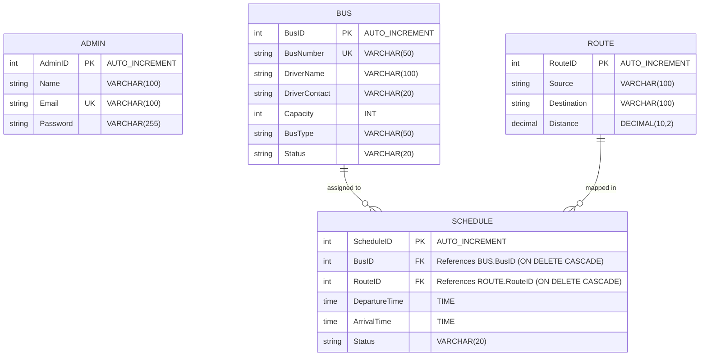

# Entity-Relationship (ER) Diagram
## Smart Bus Scheduling and Route Management System

The database schema consists of four core tables: `Admin`, `Bus`, `Route`, and `Schedule`.

---

## Entity Descriptions & Fields

### 1. Admin Entity
- **AdminID (INT, PK)**: Unique auto-incrementing key.
- **Name (VARCHAR)**: Full name of the system operator.
- **Email (VARCHAR, Unique)**: Primary email used for authentication login.
- **Password (VARCHAR)**: Secure bcrypt-hashed password string.

### 2. Bus Entity
- **BusID (INT, PK)**: Unique auto-incrementing identifier.
- **BusNumber (VARCHAR, Unique)**: Vehicle registration number (e.g. KA-01-F-1234).
- **DriverName (VARCHAR)**: Full name of the assigned driver.
- **DriverContact (VARCHAR)**: Driver phone number.
- **Capacity (INT)**: Total passenger seats.
- **BusType (VARCHAR)**: Vehicle category (e.g., AC Seater, Non-AC Seater, AC Sleeper, Non-AC Sleeper).
- **Status (VARCHAR)**: Vehicle operation status (Active, Inactive).

### 3. Route Entity
- **RouteID (INT, PK)**: Unique auto-incrementing identifier.
- **Source (VARCHAR)**: Starting terminal location.
- **Destination (VARCHAR)**: Ending terminal location.
- **Distance (DECIMAL)**: Trip length in kilometers (e.g., 22.50).

### 4. Schedule Entity
- **ScheduleID (INT, PK)**: Unique auto-incrementing identifier.
- **BusID (INT, FK)**: References the assigned vehicle. Purges schedules if the bus is deleted (`ON DELETE CASCADE`).
- **RouteID (INT, FK)**: References the assigned route path. Purges schedules if the route is deleted (`ON DELETE CASCADE`).
- **DepartureTime (TIME)**: Clock time of bus departure (e.g., 08:30:00).
- **ArrivalTime (TIME)**: Clock time of bus arrival (e.g., 09:30:00).
- **Status (VARCHAR)**: Active/Inactive state of the scheduled run.
