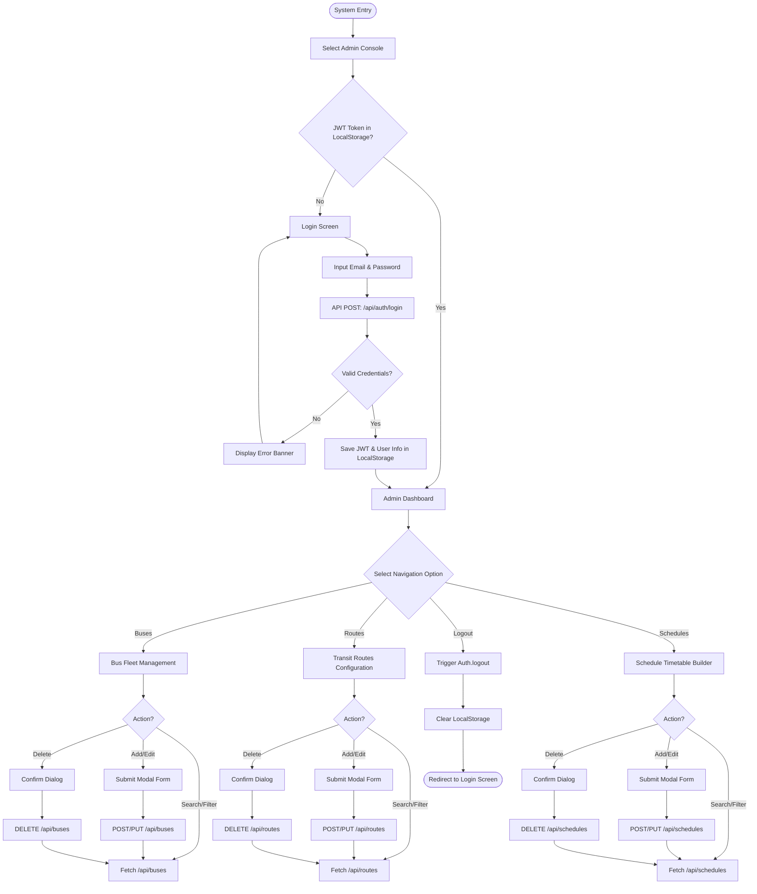
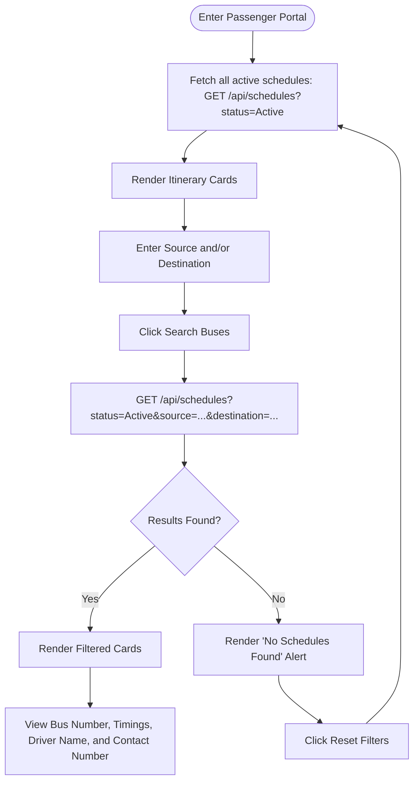

# System Flowcharts
## Smart Bus Scheduling and Route Management System

This document outlines the operational logic and navigation pathways for both administrators and passenger users.

---

## 1. Administrative Workflow

This diagram illustrates the login validation checks, access guards, dashboard controls, and database operations available to system administrators.

---

## 2. Passenger / Commuter Workflow

This diagram illustrates how passengers navigate the portal to search for buses and view timetables without requiring account registration.

